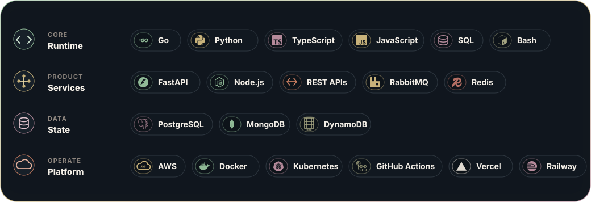

  

  

    <strong>Backend systems engineer</strong> building APIs, workers, data flows, and reliable product infrastructure.
  

  

    
    &nbsp;&nbsp;
    
  

## Hey, I'm Roshan

I'm a backend-focused engineer in Melbourne, Australia, and a founding engineer at **Sitespace**. I build production systems across APIs, data models, queues, product workflows, authentication, observability, and reliability.

Right now, I am building and operating Sitespace across backend and web: construction scheduling, asset bookings, subcontractor workflows, live calendars, and the services that support them.

## Current focus

- Designing backend services and APIs that are clear, maintainable, and easy to evolve.
- Building production workflows with clean architecture and practical reliability.
- Shipping product features across Go, Python, TypeScript, and cloud infrastructure.
- Keeping systems secure by default while preserving a good developer experience.

## Technical stack

  

## Featured projects

<table>
  <tr>
    <td width="50%">
      <h3><a href="https://github.com/Ross1116/sitespace-app">Sitespace</a></h3>
      
Construction site scheduling platform for managing assets, bookings, subcontractor workflows, and live calendars.

      
<strong>TypeScript</strong> / scheduling workflows / product UI

    </td>
    <td width="50%">
      <h3><a href="https://github.com/Ross1116/sitespace-python">Sitespace backend</a></h3>
      
Backend services for Sitespace, covering core APIs, domain logic, data workflows, and operational support.

      
<strong>Python</strong> / backend services / API design

    </td>
  </tr>
  <tr>
    <td width="50%">
      <h3><a href="https://github.com/Ross1116/cuemate-engine">CueMate Engine</a></h3>
      
Music recommendation engine for cueing and transition support, including track ranking and move classification.

      
<strong>Python</strong> / recommendation logic / audio analysis

    </td>
    <td width="50%">
      <h3><a href="https://github.com/Ross1116/swarmcdn">SwarmCDN</a></h3>
      
Peer-to-peer CDN prototype written in Go, focused on distributed delivery and coordination.

      
<strong>Go</strong> / distributed systems / networking

    </td>
  </tr>
  <tr>
    <td width="50%">
      <h3><a href="https://github.com/Ross1116/coder-copy">Coder Copy</a></h3>
      
Developer utility for parsing copied code and removing comments based on the selected language.

      
<strong>Go</strong> / developer tooling / parsing

    </td>
    <td width="50%">
      <h3><a href="https://github.com/Ross1116/pokebattlecli">PokeBattleCLI</a></h3>
      
Terminal-based battle game built in Go, with a simple game loop and command-line interface.

      
<strong>Go</strong> / terminal app / game loop

    </td>
  </tr>
</table>

## GitHub activity

  
   
  
  
  

## Engineering interests

I enjoy working where product and infrastructure meet: backend systems that are reliable, secure, and straightforward to use. I am backend-first, but I work across the stack when that is what the product needs.

  Backend first. Product-minded. Focused on shipping reliable systems.

